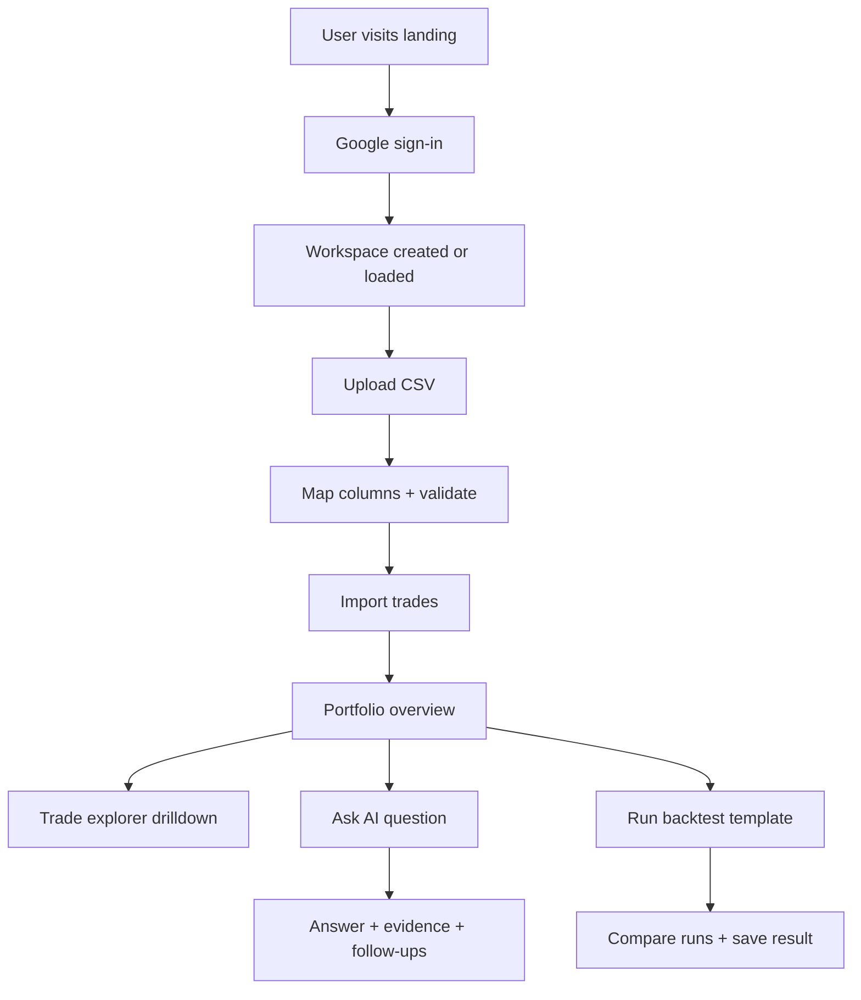

## 1. Product Overview
AI Trade Interrogator (Project Roast) is a trader-grade web dashboard that turns raw broker exports into searchable, explainable performance intelligence.
It helps active traders and small funds ingest trades, analyze PnL and risk, ask natural-language questions, and run lightweight backtests from one place.

## 2. Core Features

### 2.1 User Roles
| Role | Registration Method | Core Permissions |
|------|---------------------|------------------|
| Trader | Google OAuth | Upload trades, analyze metrics, run backtests, ask AI, manage workspace |
| Admin | Google OAuth (allowlisted domain/email) | All Trader permissions + user/workspace administration |

### 2.2 Feature Module
1. **Sign-in**: Google OAuth, session management, first-login workspace creation
2. **Trade Upload**: CSV upload, schema detection + mapping, validation, import status
3. **Portfolio Overview**: headline PnL and risk metrics, equity curve, exposure snapshots, drawdown analysis
4. **Trade Explorer**: filters, grouping, drilldowns, per-symbol/per-strategy views, export
5. **Ask AI**: natural-language interrogation over imported trades + metrics, explainability + citations to rows
6. **Backtest Lab**: parameterized backtest templates (v1), comparisons, constraints, result reproducibility
7. **Settings**: data schema rules, timezone/currency, tagging conventions, data retention, API keys (optional)

### 2.3 Page Details
| Page Name | Module Name | Feature description |
|-----------|-------------|---------------------|
| / | Landing | Product positioning, security/compliance notes, sign-in CTA |
| /auth/sign-in | OAuth | Google sign-in, error states, account selection guidance |
| /app/upload | CSV Import | Upload CSV, map columns, preview rows, validate, start import, import history |
| /app/portfolio | Overview | KPI strip (PnL, win rate, profit factor, max DD), equity curve, exposure and drawdown widgets |
| /app/trades | Explorer | Table with filters, saved views, grouping, row-level detail drawer, export CSV |
| /app/ask | AI Interrogator | Chat-like UI, query suggestions, results with “why” explanations and row citations |
| /app/backtests | Backtest Lab | Create run, parameter controls, compare runs, result artifacts, shareable permalink |
| /app/settings | Workspace | Timezone/currency, CSV templates, tagging rules, admin controls (role-based) |

## 3. Core Process
Primary flows:
- Sign in with Google → create workspace → upload CSV → map/validate → import trades → view portfolio summary → drill into trades
- Ask a question (“Why did April underperform?”) → system produces answer + supporting evidence → user refines question and saves insight
- Run a backtest template → review results → compare runs → pin a run to portfolio context

## 4. User Interface Design

### 4.1 Design Style
- Aesthetic direction: industrial/utilitarian trading terminal meets editorial “performance report”
- Theme: deep charcoal background with warm paper panels; one sharp accent color for highlights and state
- Typography: serif display for headings, neutral sans for body, monospace for numeric/data surfaces
- Layout: left rail navigation + dense-but-readable data surfaces, drawers for details, sticky filters
- Interaction: fast keyboard navigation (v1 shortcuts for search/filter), crisp hover states, subtle chart motion

### 4.2 Page Design Overview
| Page Name | Module Name | UI Elements |
|-----------|-------------|-------------|
| /app/upload | Import wizard | Dropzone, column mapper grid, preview table, validation badges, progress timeline |
| /app/portfolio | KPI + charts | KPI strip, equity curve, drawdown panel, exposure heatmap, “what changed” callouts |
| /app/trades | Table + filters | Sticky filter bar, saved views, grouped rows, detail drawer with full trade lifecycle |
| /app/ask | Interrogator | Prompt box, suggested questions, result cards, “evidence table”, copy/export insight |
| /app/backtests | Lab | Parameter panel, run queue, result compare table, small-multiple charts |
| /app/settings | Controls | Form sections, schema templates, retention settings, admin user list (if admin) |

### 4.3 Responsiveness
- Desktop-first with adaptive layout down to tablet width
- Data tables switch to “stacked rows + drawer details” on narrow screens
- Touch-safe hit targets, but preserve dense terminal feel on desktop
