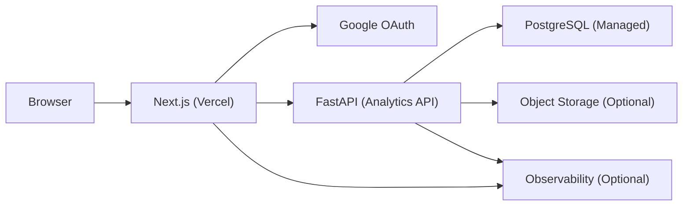
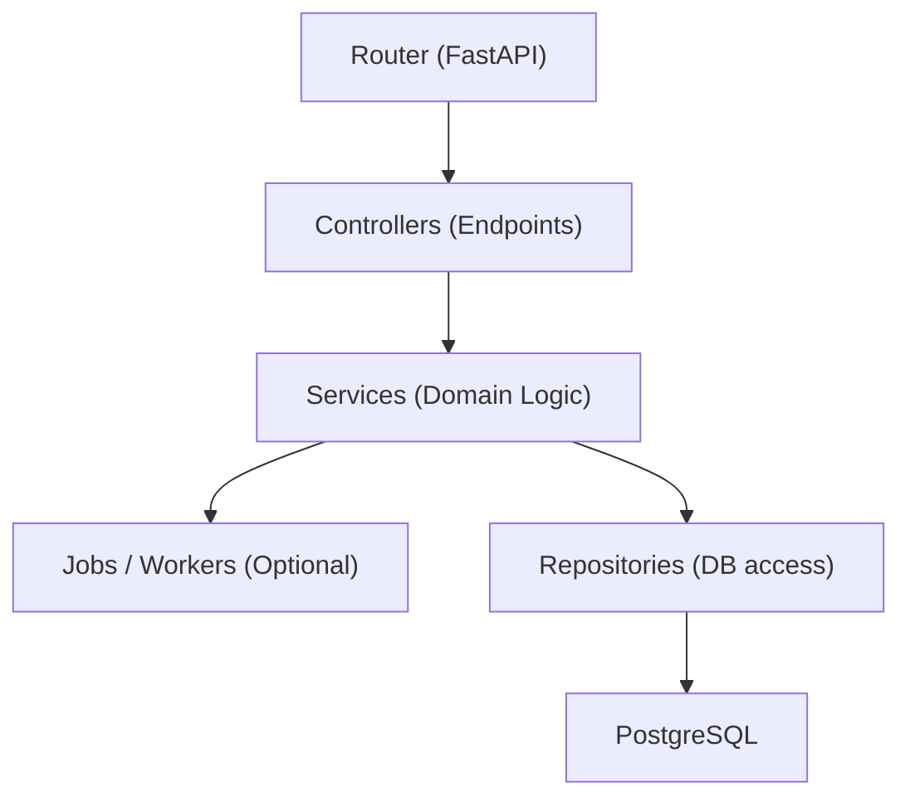
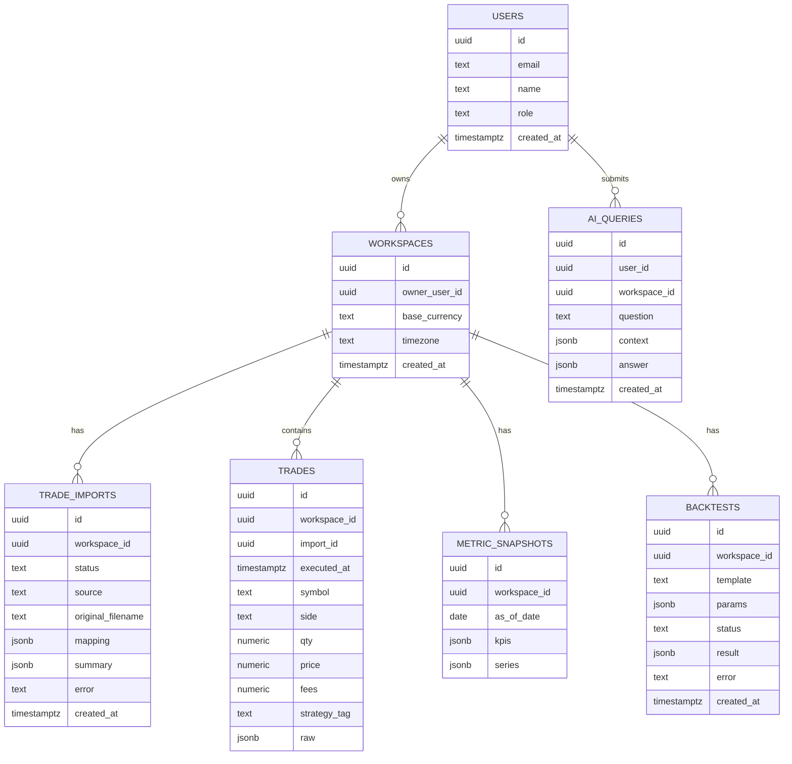

## 1. Architecture Design



Key principles:
- Next.js owns UI, routing, and user sessions (Google OAuth).
- FastAPI owns ingestion, analytics computation, backtests, and “Ask AI” orchestration.
- PostgreSQL is the system of record for users, imports, trades, metrics snapshots, and backtest artifacts.

## 2. Technology Description
- Frontend: Next.js (App Router) + TypeScript + Tailwind CSS + Zustand (local state) + TanStack Query (server state)
- Auth: Auth.js / NextAuth with Google provider (JWT session strategy)
- Backend: Python + FastAPI + Pydantic + SQLAlchemy 2.x
- Migrations: Alembic
- Database: PostgreSQL (managed; e.g., Neon/Supabase/RDS)
- Background work: in-process queue for dev; optional worker process for production ingestion/backtests
- Files: store normalized trades in Postgres; optionally store raw CSV in object storage

## 3. Route Definitions
| Route | Purpose |
|-------|---------|
| / | Landing + sign-in CTA |
| /auth/sign-in | Sign-in flow + auth errors |
| /app/upload | CSV import wizard + import history |
| /app/portfolio | Portfolio KPIs + charts |
| /app/trades | Trade explorer (filters, groups, drilldown) |
| /app/ask | Natural-language interrogation workspace |
| /app/backtests | Backtest lab + run comparison |
| /app/settings | Workspace settings + admin tools |

## 4. API Definitions

Authentication (service-to-service):
- Frontend obtains user session via Google OAuth.
- For API calls, frontend sends an Authorization header with a backend token obtained by exchanging the authenticated session at `POST /v1/auth/exchange`.
- Backend token is short-lived and scoped to a workspace/user; it is used for all `/v1/*` endpoints.

Core endpoints (v1):
- `POST /v1/auth/exchange`
  - Request: `{ "session": { "provider": "google", "idToken": "..." } }`
  - Response: `{ "accessToken": "...", "expiresIn": 900 }`
- `POST /v1/trade-imports`
  - Request: multipart upload (CSV) + `{ "timezone": "...", "currency": "..." }`
  - Response: `{ "importId": "...", "status": "queued" }`
- `GET /v1/trade-imports/{importId}`
  - Response: `{ "status": "queued|running|failed|completed", "summary": { ... } }`
- `GET /v1/trades`
  - Query: `symbol`, `dateFrom`, `dateTo`, `side`, `strategyTag`, `limit`, `cursor`
  - Response: `{ "items": [ ... ], "nextCursor": "..." }`
- `GET /v1/metrics/portfolio`
  - Response: `{ "kpis": { ... }, "equityCurve": [ ... ], "drawdowns": [ ... ] }`
- `POST /v1/ask`
  - Request: `{ "question": "...", "context": { "dateRange": "...", "filters": { ... } } }`
  - Response: `{ "answer": "...", "evidence": { "trades": [ ... ], "metrics": [ ... ] }, "followUps": [ ... ] }`
- `POST /v1/backtests`
  - Request: `{ "template": "v1-mean-reversion|v1-breakout", "params": { ... }, "dateRange": { ... } }`
  - Response: `{ "backtestId": "...", "status": "queued" }`
- `GET /v1/backtests/{backtestId}`
  - Response: `{ "status": "queued|running|failed|completed", "result": { ... } }`

## 5. Server Architecture Diagram



## 6. Data Model

### 6.1 Data Model Definition


### 6.2 Data Definition Language
```sql
create table if not exists users (
  id uuid primary key,
  email text not null unique,
  name text,
  role text not null default 'trader',
  created_at timestamptz not null default now()
);

create table if not exists workspaces (
  id uuid primary key,
  owner_user_id uuid not null references users(id) on delete cascade,
  base_currency text not null default 'USD',
  timezone text not null default 'UTC',
  created_at timestamptz not null default now()
);
create index if not exists workspaces_owner_user_id_idx on workspaces(owner_user_id);

create table if not exists trade_imports (
  id uuid primary key,
  workspace_id uuid not null references workspaces(id) on delete cascade,
  status text not null,
  source text not null default 'csv',
  original_filename text,
  mapping jsonb,
  summary jsonb,
  error text,
  created_at timestamptz not null default now()
);
create index if not exists trade_imports_workspace_id_created_at_idx on trade_imports(workspace_id, created_at desc);

create table if not exists trades (
  id uuid primary key,
  workspace_id uuid not null references workspaces(id) on delete cascade,
  import_id uuid references trade_imports(id) on delete set null,
  executed_at timestamptz not null,
  symbol text not null,
  side text not null,
  qty numeric not null,
  price numeric not null,
  fees numeric not null default 0,
  strategy_tag text,
  raw jsonb
);
create index if not exists trades_workspace_id_executed_at_idx on trades(workspace_id, executed_at desc);
create index if not exists trades_workspace_id_symbol_idx on trades(workspace_id, symbol);

create table if not exists metric_snapshots (
  id uuid primary key,
  workspace_id uuid not null references workspaces(id) on delete cascade,
  as_of_date date not null,
  kpis jsonb not null,
  series jsonb,
  created_at timestamptz not null default now()
);
create unique index if not exists metric_snapshots_workspace_id_as_of_date_ux on metric_snapshots(workspace_id, as_of_date);

create table if not exists backtests (
  id uuid primary key,
  workspace_id uuid not null references workspaces(id) on delete cascade,
  template text not null,
  params jsonb not null,
  status text not null,
  result jsonb,
  error text,
  created_at timestamptz not null default now()
);
create index if not exists backtests_workspace_id_created_at_idx on backtests(workspace_id, created_at desc);

create table if not exists ai_queries (
  id uuid primary key,
  user_id uuid not null references users(id) on delete cascade,
  workspace_id uuid not null references workspaces(id) on delete cascade,
  question text not null,
  context jsonb,
  answer jsonb,
  created_at timestamptz not null default now()
);
create index if not exists ai_queries_workspace_id_created_at_idx on ai_queries(workspace_id, created_at desc);
```
